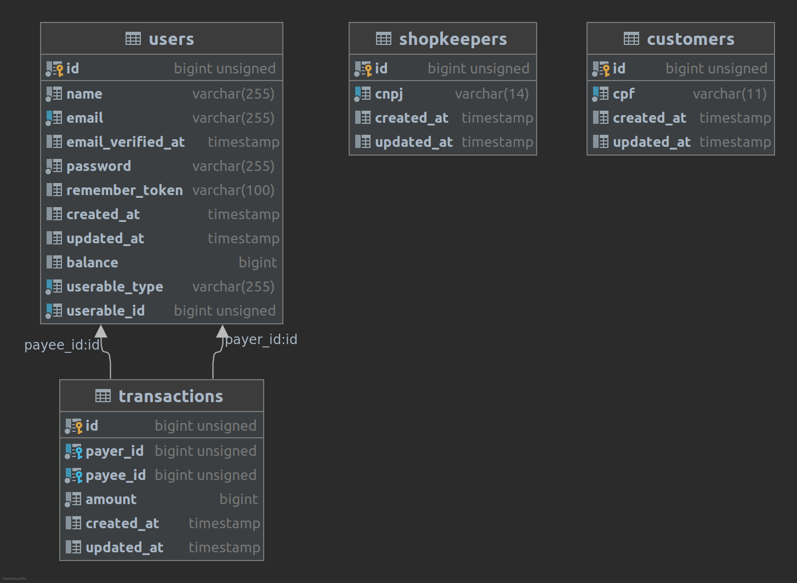

# Backend challenge

This application aims to meet the requirements for a PHP Developer on a job application.

## Overview

This app was developed using [Laravel 8](https://laravel.com/), [MySQL 8](https://dev.mysql.com/doc/relnotes/mysql/8.0/en/), [Composer 2](https://getcomposer.org/download/) and [Nginx](https://www.nginx.com/). 

Besides, the fact that docker-compose has a redis service, it is not used in the project right now. I decided to put it for using it in future to do some operations using Laravel Queue driver.

## First steps - Installation

This project only has one POST endpoint that can be reached on `api/v1/transactions`;

To run this project follow these steps;
 - `git clone git@github.com:cmontezano/desafio-backend.git`;
 - Run `make` to create environment file, build docker-compose containers, up containers, install composer dependencies and generate laravel app key.
 - To run feature tests: `make test`;
 - If you want to seed the database you can run: `docker-compose exec app php artisan db:seed`

At this point the `POST transaction` endpoint is ready to be reached.

## Architecture concepts

This project use some architectural concepts like Repositories, Services and Gateways.

For the future, my plan is to use Event Sourcing architecture pattern to control the chain of events that occurs when a transaction is dispatched.

## Database model

